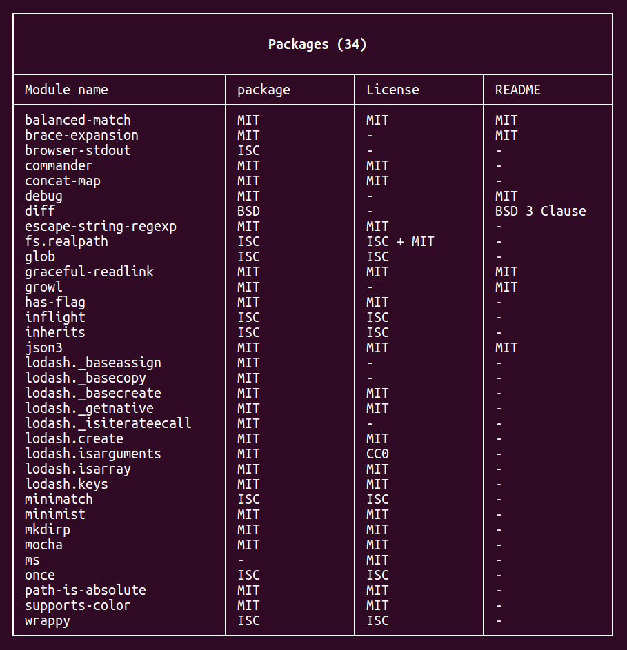

# Legally - check your licenses

> Disclaimer: I am not a lawyer and this is not legal advice

Discover the license of the npm packages that you are using easily: Just install it globally and run it in your project folder:

```bash
npm install legally -g
cd ./YOUR_PROJECT_NAME
legally
```

It will display first those node_modules' licenses:



> `-` means the license couldn't be found and `? verify` that it was found but couldn't be parsed

And then the license count in your project (different example from the one above):


Finally, you will get a small report stating whether everything is correct or not:


## Documentation

You can pass few command line arguments. The main ones are to only show a part of the whole analysis:

```bash
# List of packages and their licenses
legally -packages

# Breakdown of what licenses your dependencies have
legally -licenses

# Overview with actionable points
legally -reports
```

If the table is not displaying correctly, you can pass it a `--border` option with 'ascii':

```bash
legally --border thin
legally --border bold
legally --border double
legally --border ascii  # This will work in most systems
```

**[Not yet implemented]** You can also check any remote package by doing:

```bash
legally express -report
```

It will take a while since it has to download it and it's dependencies.


## FAQ

**It says `'No modules installed'`**

Make sure that you are in the root folder for your project; doing `ls` you should be able to see `node_modules`


**Does it check all modules by npm?**

Yes, it will check all of the modules in `node_modules` and the nested ones except for `.bin`.


**What licenses does it check?**

It attempts to find Apache, BSD (2 and 3 Clause), CC0, ISC and MIT. This list *is* short, so please feel free to expand it adding a new file in `/licenses`:

```js
// File /licenses/mit.js
module.exports.name = 'MIT';
module.exports.regex = /(?:The )?MIT(?: (L|l)icense)/;
module.exports.text = `
  Permission is hereby granted, free of charge, to any person obtaining a copy
  ...
  furnished to do so, subject to the following conditions:

  The above copyright notice and this permission notice shall be included in
  all copies or substantial portions of the Software.
`;
module.exports.fragments = module.exports.text.split(/\n\n/);
```
